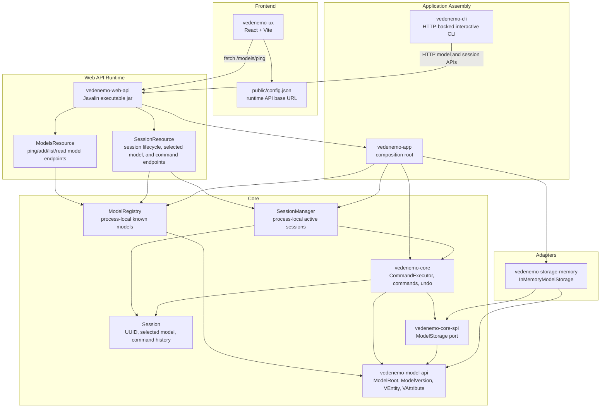
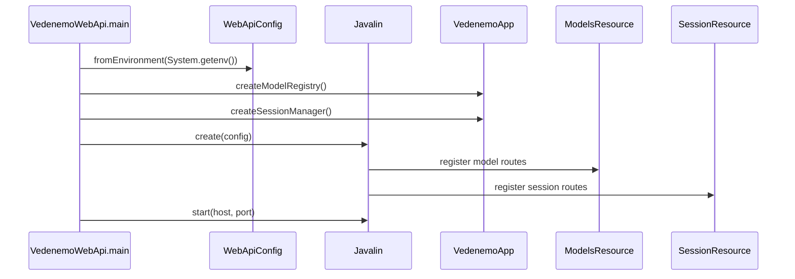
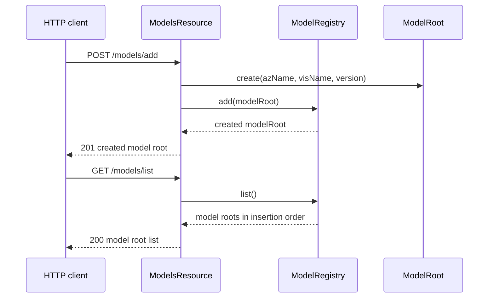
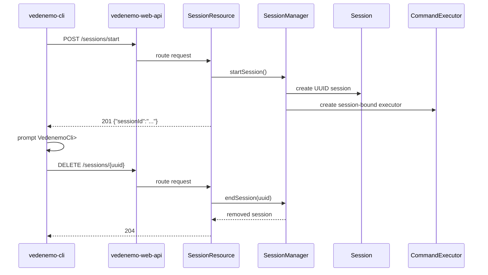
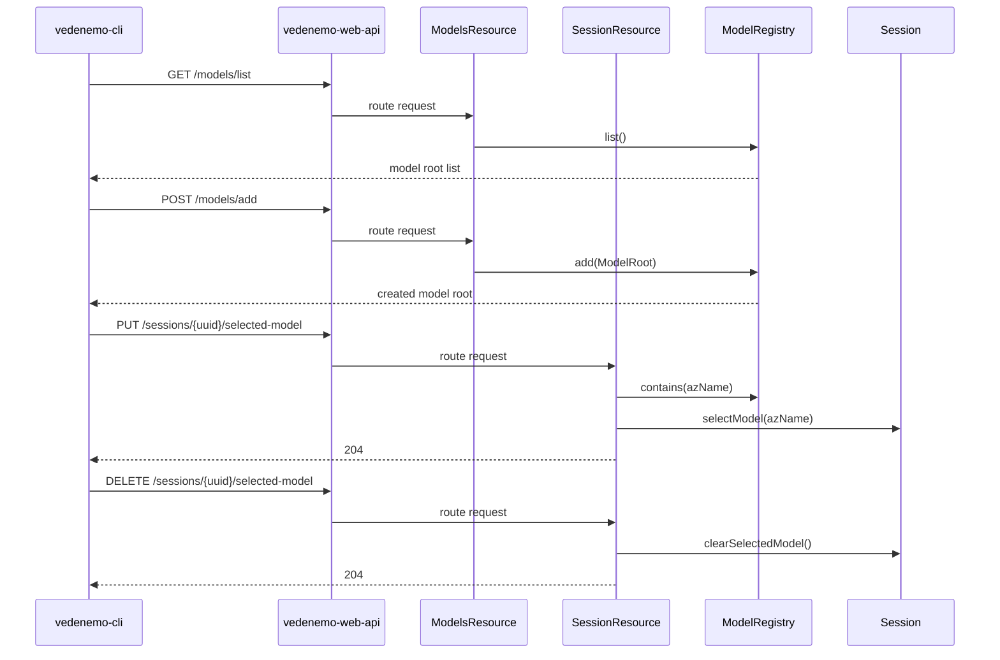
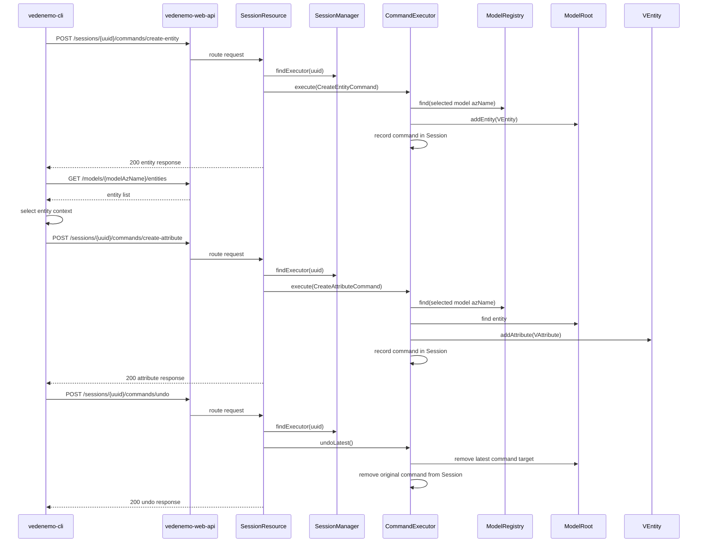
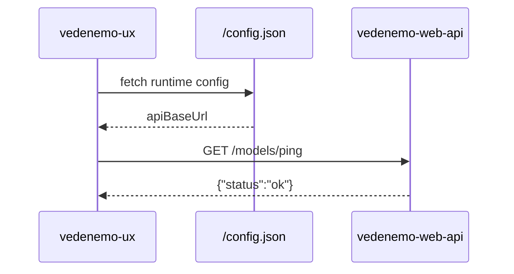

# Vedenemo Current Architecture

This document describes the current concrete implementation in this repository.
It is intentionally separate from architecture definition, roadmap, and planning
documents, which may describe rules or intended future direction.

## Overview

Vedenemo is currently a monorepo with a Java 21 Maven backend, a separate Vite
React frontend, GitHub Actions CI, and Firebase Hosting deployment for the UX.
The backend is split into small Maven modules with a pure core and adapter
modules around it.

## Backend Modules

### `vedenemo-model-api`

Shared model API module. It currently contains:

- `ModelRoot`, the first concrete model root entity, which owns ordered
  `VEntity` instances
- `ModelVersion`, a normalized semantic version value
- `Versionable`, an abstract base class for model elements with lifecycle
  version metadata
- `DataType`, the initial enum of supported attribute data types:
  `TEXT`, `NUMERIC`, `URL`, and `DATA`
- `VAttribute`, a model attribute with `azName`, `visName`, `DataType`, and
  lifecycle version metadata
- `VEntity`, a model entity with `azName`, `visName`, lifecycle version
  metadata, and an ordered attribute collection

`ModelRoot`, `VEntity`, and `VAttribute` share the same `azName` rule: the name
must start with an ASCII letter and then contain only ASCII letters and
underscores. Original casing is preserved. Case-insensitive uniqueness keys are
used where uniqueness is enforced.

`VEntity` preserves attribute insertion order and enforces attribute `azName`
uniqueness case-insensitively. It exposes attributes as a read-only snapshot
list. Attributes can be removed by `azName` or by `VAttribute` instance while a
model is under construction.

`ModelRoot` preserves entity insertion order and enforces entity `azName`
uniqueness case-insensitively. It exposes entities as a read-only snapshot list.
Entities can be removed by `azName` or by `VEntity` instance while a model is
under construction.

`Versionable` requires `activeSince`. `deprecatedSince` is optional, but when it
is present it must be strictly later than `activeSince`.

Dependencies: Java JDK only.

### `vedenemo-core-spi`

Core-facing service provider interfaces. It currently defines `ModelStorage`
with `save` and `load` operations for `ModelRoot`.

Dependencies:

- `vedenemo-model-api`
- Java JDK

### `vedenemo-core`

Core command module. It currently contains a sealed `Command` marker interface,
`NoOpCommand`, `CreateEntityCommand`, `CreateAttributeCommand`, internal
`DeleteEntityCommand` and `DeleteAttributeCommand` counterparts, `UndoResult`,
`CommandExecutor`, `Session`, `SessionManager`, and `ModelRegistry`.

`Session` represents a process-local user work session. It has a UUID, an
optional selected model reference stored as `ModelRoot.azName`, execution-order
command history, a reverse-order command history snapshot, and a latest-command
removal operation used by undo.

`SessionManager` creates sessions and keeps active session-bound
`CommandExecutor` instances in memory. Ending a session removes the active
executor and session from the manager.

`CommandExecutor` is bound to exactly one active `Session` and the process-local
`ModelRegistry`. It can execute `CreateEntityCommand` against the selected
model and `CreateAttributeCommand` against an entity in the selected model.
Successful commands are recorded in the session. Failed commands are not
recorded. Undo is stack-based and only applies to the latest successful command:
create-entity is undone through the internal `DeleteEntityCommand` inverse, and
create-attribute is undone through the internal `DeleteAttributeCommand`
inverse. Undo removes the original command from active session command history.

`ModelRegistry` is the process-local registry of currently known models. It
stores `ModelRoot` instances in insertion order and enforces case-insensitive
`azName` uniqueness while preserving the original submitted casing.

User-visible attribute deletion as a standalone edit operation is not
implemented yet; `DeleteAttributeCommand` exists only as the internal inverse
for undoing attribute creation.

Dependencies:

- `vedenemo-model-api`
- `vedenemo-core-spi`
- Java JDK

### `vedenemo-storage-memory`

Initial in-memory storage adapter. `InMemoryModelStorage` implements
`ModelStorage` with a `HashMap` of `ModelRoot` instances.

Dependencies:

- `vedenemo-model-api`
- `vedenemo-core-spi`
- Java JDK

### `vedenemo-app`

Application composition root. It currently wires `CommandExecutor` to
`InMemoryModelStorage`, creates process-local `SessionManager` instances, and
creates a process-local `ModelRegistry`.

Dependencies:

- `vedenemo-core`
- `vedenemo-storage-memory`

### `vedenemo-cli`

Minimal command-line entry point. It reads the backend base URL from
`VEDENEMO_API_BASE_URL`, defaulting to `http://127.0.0.1:8080`, creates a
backend session through `POST /sessions/start`, and enters an interactive prompt
loop.

Current CLI behavior:

- prints the created session UUID
- prompts with `VedenemoCli>`
- prompts with `VedenemoCli[azName]>` when a model is attached
- prompts with `VedenemoCli[modelAzName/entityAzName]>` when a model is
  attached and an entity is selected
- treats an empty line as an empty echo plus a new prompt
- supports `help`
- lists current backend models with `list`
- adds a new backend model with `add`, using version `1.0.0`
- when a model is attached, reuses `add` to create a new entity in that model
  through the backend command API
- lists entities in the attached model with `entities`
- selects an entity with `entity [N | azName]`
- clears only selected entity context with `entity detach`
- lists attributes in the selected entity with `attributes`, including data
  type and lifecycle version fields
- creates attributes in the selected entity with `attr add`
- attaches the session to a model by latest list number or `azName`
- detaches the session from the current selected model
- supports `undo` for the latest backend command
- supports `exit`
- calls `DELETE /sessions/{uuid}` during normal exit and through a best-effort
  shutdown hook

Dependencies:

- Java JDK

### `vedenemo-web-api`

Minimal HTTP runtime module. It packages an executable shaded JAR using Javalin
and exposes:

- `GET /models/ping`, which returns `{"status":"ok"}`
- `POST /models/add`, which adds a `ModelRoot` to the process-local registry
- `GET /models/list`, which returns the current process-local model registry
- `GET /models/{modelAzName}/entities`, which lists entities in insertion order
  for one model
- `GET /models/{modelAzName}/entities/{entityAzName}/attributes`, which lists
  attributes in insertion order for one entity, including `DataType` and
  lifecycle version fields
- `POST /sessions/start`, which creates a backend session and returns its UUID
- `DELETE /sessions/{uuid}`, which ends/removes a backend session
- `PUT /sessions/{uuid}/selected-model`, which selects an existing model for a
  backend session
- `DELETE /sessions/{uuid}/selected-model`, which clears the selected model for
  a backend session
- `POST /sessions/{uuid}/commands/create-entity`, which creates a `VEntity` in
  the session's selected model through `CommandExecutor`
- `POST /sessions/{uuid}/commands/create-attribute`, which creates a
  `VAttribute` in an entity in the session's selected model through
  `CommandExecutor`
- `POST /sessions/{uuid}/commands/undo`, which undoes the latest command for
  the active backend session or returns `304` when nothing can be undone

HTTP JSON parsing and response serialization are kept in this module. Jackson is
used here as an adapter/runtime dependency and does not leak into core or model
APIs.

Runtime configuration is read from environment variables:

- `VEDENEMO_WEB_HOST`, default `127.0.0.1`
- `VEDENEMO_WEB_PORT`, default `8080`
- `VEDENEMO_ALLOWED_ORIGINS`, default `*`

Dependencies:

- `vedenemo-app`
- `vedenemo-core`
- Javalin
- Jackson Databind
- `slf4j-simple` at runtime

## Frontend

### `vedenemo-ux`

Vite React application. It loads `/config.json` at runtime and uses
`apiBaseUrl` to call the backend ping endpoint.

Current user-facing behavior:

- renders a minimal deployment check page
- shows the configured backend URL
- includes a Ping button that calls `{apiBaseUrl}/models/ping`

The default runtime config in `vedenemo-ux/public/config.json` points to a
Tailscale HTTPS backend URL.

## Runtime Flows

### Web API Startup

### Add And List Models

### CLI Session Lifecycle

### CLI Model Management

### CLI Entity And Attribute Commands With Undo

### UX Ping

## CI and Deployment

GitHub Actions contains separate backend and frontend CI workflows:

- backend CI runs `mvn -B clean verify`
- frontend CI runs `npm ci` and `npm run build` in `vedenemo-ux`

Backend verification includes focused model API tests for `ModelRoot`,
`VAttribute`, `VEntity`, and lifecycle validation, focused core tests for
`Session`, `SessionManager`, create-entity/create-attribute command execution,
and undo behavior, focused CLI tests for backend URL configuration, non-hanging
prompt behavior, model commands, entity context, attribute command creation, and
undo output, JUnit 5 endpoint tests for the model add/list/entity/attribute
read APIs, session lifecycle, selected-model, create-entity, create-attribute,
and undo HTTP APIs in `vedenemo-web-api`, and focused `InMemoryModelStorage`
tests for storing and loading `ModelRoot` instances.

The UX deployment workflow builds `vedenemo-ux` and deploys it to Firebase
Hosting when required GitHub variables are present. The deployment workflow can
override `public/config.json` from the `VEDENEMO_API_BASE_URL` GitHub variable.

## Architectural Constraints Reflected In Code

- `vedenemo-core` has only Vedenemo-owned module dependencies and Java JDK APIs.
- Storage is accessed through the Vedenemo-owned `ModelStorage` SPI.
- The in-memory storage adapter depends on the SPI; core does not depend on the
  adapter.
- HTTP framework and JSON dependencies are isolated in `vedenemo-web-api`.
- The CLI talks to the backend through JDK HTTP client APIs and does not import
  Javalin, Jackson, or Vedenemo core types.
- Application assembly is explicit constructor wiring, currently in
  `vedenemo-app`, `vedenemo-cli`, and the web API runtime.
- The current model registry and session manager are process-local and not
  durable.

## Current Gaps

The current implementation does not yet contain:

- user-visible deletion/edit commands for entities or attributes
- generic command envelope or command replay persistence
- durable persistence
- parser, scripting, plugin, or visualization implementations
