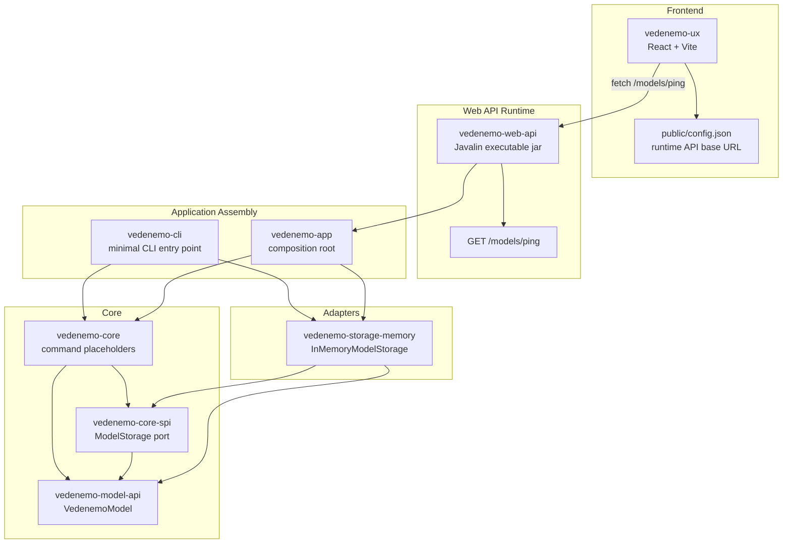
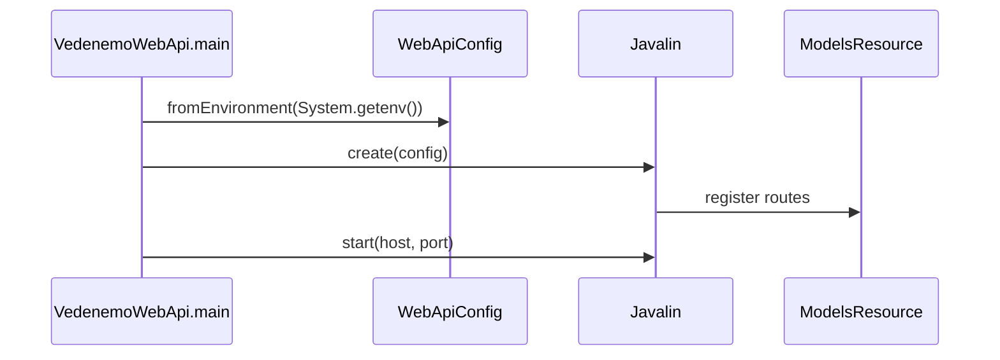
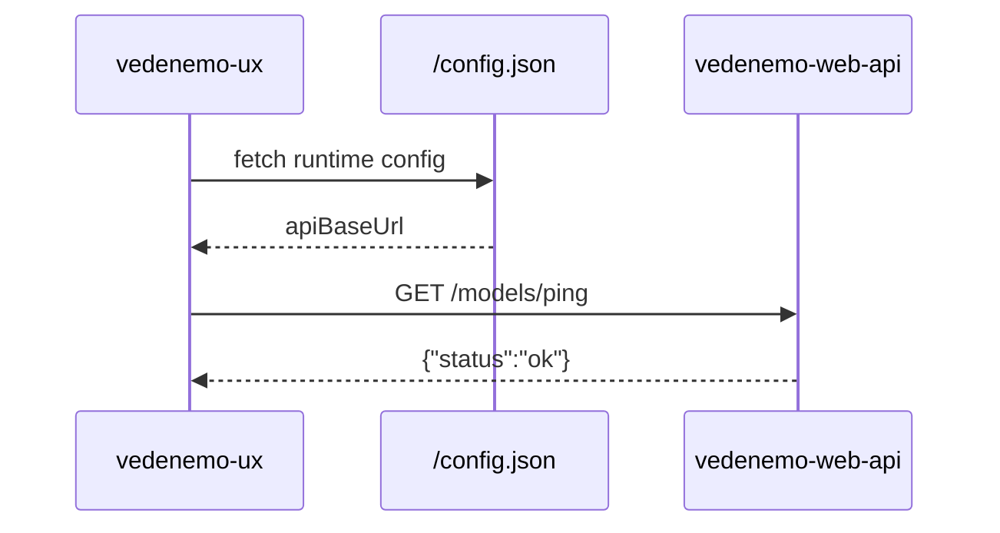

# Vedenemo Current Architecture

This document describes the current concrete implementation in this repository.
It is intentionally separate from architecture definition, roadmap, and planning
documents, which may describe rules or intended future direction.

## Overview

Vedenemo is currently a monorepo with a Java 21 Maven backend, a separate Vite
React frontend, GitHub Actions CI, and Firebase Hosting deployment for the UX.
The backend is split into small Maven modules with a pure core and adapter
modules around it.

## Backend Modules

### `vedenemo-model-api`

Shared model API module. It currently contains `VedenemoModel`, a minimal
immutable record with an `id`.

Dependencies: Java JDK only.

### `vedenemo-core-spi`

Core-facing service provider interfaces. It currently defines `ModelStorage`
with `save` and `load` operations for `VedenemoModel`.

Dependencies:

- `vedenemo-model-api`
- Java JDK

### `vedenemo-core`

Core command module. It currently contains a sealed `Command` marker interface,
`NoOpCommand`, and `CommandExecutor`. Real command behavior is not implemented
yet.

Dependencies:

- `vedenemo-model-api`
- `vedenemo-core-spi`
- Java JDK

### `vedenemo-storage-memory`

Initial in-memory storage adapter. `InMemoryModelStorage` implements
`ModelStorage` with a `HashMap`.

Dependencies:

- `vedenemo-model-api`
- `vedenemo-core-spi`
- Java JDK

### `vedenemo-app`

Application composition root. It currently wires `CommandExecutor` to
`InMemoryModelStorage`.

Dependencies:

- `vedenemo-core`
- `vedenemo-storage-memory`

### `vedenemo-cli`

Minimal command-line entry point. It constructs a `CommandExecutor` with
`InMemoryModelStorage` and prints a startup message.

Dependencies:

- `vedenemo-core`
- `vedenemo-storage-memory`

### `vedenemo-web-api`

Minimal HTTP runtime module. It packages an executable shaded JAR using Javalin
and exposes `GET /models/ping`, which returns `{"status":"ok"}`.

Runtime configuration is read from environment variables:

- `VEDENEMO_WEB_HOST`, default `127.0.0.1`
- `VEDENEMO_WEB_PORT`, default `8080`
- `VEDENEMO_ALLOWED_ORIGINS`, default `*`

Dependencies:

- `vedenemo-app`
- Javalin
- `slf4j-simple` at runtime

## Frontend

### `vedenemo-ux`

Vite React application. It loads `/config.json` at runtime and uses
`apiBaseUrl` to call the backend ping endpoint.

Current user-facing behavior:

- renders a minimal deployment check page
- shows the configured backend URL
- includes a Ping button that calls `{apiBaseUrl}/models/ping`

The default runtime config in `vedenemo-ux/public/config.json` points to a
Tailscale HTTPS backend URL.

## Runtime Flows

### Web API Startup

### UX Ping

## CI and Deployment

GitHub Actions contains separate backend and frontend CI workflows:

- backend CI runs `mvn -B clean verify`
- frontend CI runs `npm ci` and `npm run build` in `vedenemo-ux`

The UX deployment workflow builds `vedenemo-ux` and deploys it to Firebase
Hosting when required GitHub variables are present. The deployment workflow can
override `public/config.json` from the `VEDENEMO_API_BASE_URL` GitHub variable.

## Architectural Constraints Reflected In Code

- `vedenemo-core` has only Vedenemo-owned module dependencies and Java JDK APIs.
- Storage is accessed through the Vedenemo-owned `ModelStorage` SPI.
- The in-memory storage adapter depends on the SPI; core does not depend on the
  adapter.
- HTTP framework dependencies are isolated in `vedenemo-web-api`.
- Application assembly is explicit constructor wiring, currently in
  `vedenemo-app`, `vedenemo-cli`, and the web API runtime.

## Current Gaps

The current implementation does not yet contain:

- real command execution behavior
- real model structure beyond `VedenemoModel.id`
- durable persistence
- JSON serialization for domain models
- REST resources beyond `/models/ping`
- parser, scripting, plugin, or visualization implementations
