# Vedenemo Current Architecture

This document describes the current concrete implementation in this repository.
It is intentionally separate from architecture definition, roadmap, and planning
documents, which may describe rules or intended future direction.

## Overview

Vedenemo is currently a monorepo with a Java 21 Maven backend, a separate Vite
React frontend, GitHub Actions CI, and Firebase Hosting deployment for the UX.
The backend is split into small Maven modules with a pure core and adapter
modules around it.

```mermaid
flowchart TB

subgraph UX["Frontend"]
    ViteUX["vedenemo-ux<br/>React + Vite"]
    RuntimeConfig["public/config.json<br/>runtime API base URL"]
    UXModelEvents["ModelChangeEventAdapter<br/>browser WebSocket listener"]
    UXPlantUml["PlantUmlModelAdapter<br/>model-to-PlantUML source"]
    UXPlantUmlRenderer["PlantUmlDiagramRendererAdapter<br/>lazy PlantUML SVG renderer"]
    UXInstanceTree["Model instances tab<br/>runtime entity count tree"]
    UXEntityEditor["Data editor<br/>/editor entity and association tabs"]
    UXApiDocs["Model instance API docs<br/>/modelInstanceApi docs and try-it controls"]
    UXVisualizer["Visualization wizard<br/>/visualizeWizard runtime D3 charts"]
    UXConsole["browser virtual CLI<br/>/console and embedded pane"]
end

subgraph Web["Web API Runtime"]
    WebApi["vedenemo-web-api<br/>Javalin executable jar"]
    ModelsResource["ModelsResource<br/>ping/add/list/read model endpoints"]
    SessionResource["SessionResource<br/>session lifecycle, selected model, and command endpoints"]
    ConsoleResource["ConsoleResource<br/>browser console-session endpoints"]
    InstanceDataResource["InstanceDataResource<br/>dynamic /data instance endpoints"]
    ConsoleRegistry["WebConsoleSessionRegistry<br/>browser session wrapper"]
    ModelEvents["ModelChangeBroadcaster<br/>/models/events WebSocket"]
end

subgraph App["Application Assembly"]
    AppRoot["vedenemo-app<br/>composition root"]
    Cli["vedenemo-cli<br/>HTTP-backed interactive CLI"]
    CommandConsole["vedenemo-command-console<br/>shared CLI-like command flow"]
end

subgraph Core["Core"]
    CoreModule["vedenemo-core<br/>CommandExecutor, commands, undo"]
    ScriptService["VedenemoScriptService<br/>.vdos import/export"]
    InstanceService["ModelInstanceService<br/>schema-validated instance data"]
    DumpService["ModelInstanceDumpService<br/>.vdmp import/export/precheck"]
    InstanceRegistry["ModelInstanceRegistry<br/>process-local runtime data"]
    CommandJournal["ModelCommandJournal<br/>model-level command history"]
    SessionManager["SessionManager<br/>process-local active sessions"]
    Session["Session<br/>UUID, selected model, command history"]
    ModelRegistry["ModelRegistry<br/>process-local known models"]
    Spi["vedenemo-core-spi<br/>ModelStorage, SnapshotStore, and dump-store ports"]
    ModelApi["vedenemo-model-api<br/>ModelRoot, entities, attributes, associations"]
end

subgraph Adapters["Adapters"]
    MemoryStorage["vedenemo-storage-memory<br/>InMemoryModelStorage"]
    GcsStorage["vedenemo-storage-gcs<br/>GCS snapshot and dump stores"]
end

ViteUX --> RuntimeConfig
ViteUX -->|fetch model data| UXPlantUml
ViteUX -->|connect/disconnect| UXModelEvents
ViteUX -->|lazy render diagram| UXPlantUmlRenderer
ViteUX -->|fetch runtime instance counts| UXInstanceTree
ViteUX -->|create/update runtime entity data and links| UXEntityEditor
ViteUX -->|render and execute root-scoped API docs| UXApiDocs
ViteUX -->|bind and render runtime instance data| UXVisualizer
ViteUX --> UXConsole
UXPlantUml -->|GET model/entity/attribute APIs| WebApi
UXInstanceTree -->|GET /models/list and /data APIs| WebApi
UXEntityEditor -->|GET/POST/PUT /data APIs| WebApi
UXApiDocs -->|GET metadata and execute root-scoped /data APIs| WebApi
UXVisualizer -->|GET metadata, entity data, and association links| WebApi
UXModelEvents -->|WebSocket /models/events| WebApi
UXConsole -->|HTTP console commands| WebApi
Cli -->|HTTP model and session APIs| WebApi
Cli --> CommandConsole
WebApi --> ModelsResource
WebApi --> SessionResource
WebApi --> ConsoleResource
WebApi --> InstanceDataResource
WebApi --> ModelEvents
WebApi --> AppRoot
WebApi --> GcsStorage
ConsoleResource --> ConsoleRegistry
ConsoleRegistry --> CommandConsole
ConsoleRegistry --> SessionManager
ConsoleRegistry --> ModelRegistry
ModelsResource --> ModelRegistry
ModelsResource --> ScriptService
ModelsResource --> ModelEvents
SessionResource --> SessionManager
SessionResource --> ModelRegistry
SessionResource --> ModelEvents
InstanceDataResource --> InstanceService
InstanceDataResource --> DumpService
AppRoot --> CoreModule
AppRoot --> ModelRegistry
AppRoot --> SessionManager
AppRoot --> MemoryStorage
SessionManager --> Session
SessionManager --> CoreModule
SessionManager --> CommandJournal
CoreModule --> CommandJournal
ScriptService --> ModelRegistry
ScriptService --> CommandJournal
ScriptService --> ModelApi
DumpService --> InstanceService
InstanceService --> InstanceRegistry
InstanceService --> ModelRegistry
InstanceService --> ModelApi
ModelRegistry --> ModelApi
CoreModule --> Spi
CoreModule --> ModelApi
CoreModule --> Session
Spi --> ModelApi
MemoryStorage --> Spi
MemoryStorage --> ModelApi
GcsStorage --> Spi
```

## Backend Modules

### `vedenemo-model-api`

Shared model API module. It currently contains:

- `ModelRoot`, the first concrete model root entity, which owns ordered
  `VEntity` instances and ordered model-level associations
- `ModelVersion`, a normalized semantic version value
- `Versionable`, an abstract base class for model elements with lifecycle
  version metadata
- `Cardinality`, a pure value object for association multiplicity text such as
  `1`, `0..1`, `0..*`, `1..*`, and bounded ranges
- `DataType`, the enum of supported attribute data types: `TEXT`, `NUMERIC`,
  `URL`, `DATA`, `DATE`, `TIME`, and `DATETIME`
- `VAttribute`, a model attribute with `azName`, `visName`, `DataType`, and
  lifecycle version metadata
- `VEntity`, a model entity with `azName`, `visName`, lifecycle version
  metadata, and an ordered attribute collection
- `Association`, a sealed interface for first-class model-level associations
- `OwnershipAssociation` and `ReferenceAssociation`, directed associations
  with `azName`, `visName`, source entity `azName`, target entity `azName`,
  `Cardinality`, and lifecycle version metadata
- `RelationAssociation` and `RelationEnd`, which model a bidirectional
  relation as one association identity with two named ends; each end has an
  entity `azName`, role name, and `Cardinality`

`ModelRoot`, `VEntity`, and `VAttribute` share the same `azName` rule: the name
must start with an ASCII letter and then contain only ASCII letters, ASCII
digits, and underscores. Original casing is preserved. Case-insensitive
uniqueness keys are used where uniqueness is enforced.

`VEntity` preserves attribute insertion order and enforces attribute `azName`
uniqueness case-insensitively. It exposes attributes as a read-only snapshot
list. Attributes can be removed by `azName` or by `VAttribute` instance while a
model is under construction.

`ModelRoot` preserves entity and association insertion order. It enforces entity
`azName` uniqueness and association `azName` uniqueness case-insensitively in
separate model-level namespaces. Association creation validates that source and
target entities already exist. Relations validate both named ends through the
same model-level association collection. Entities and associations are exposed
as read-only snapshot lists and can be removed while a model is under
construction or while undo applies an inverse command.

`Versionable` requires `activeSince`. `deprecatedSince` is optional, but when it
is present it must be strictly later than `activeSince`.

Dependencies: Java JDK only.

### `vedenemo-core-spi`

Core-facing service provider interfaces. It currently defines `ModelStorage`
with `save` and `load` operations for `ModelRoot`, `SnapshotStore` for Vedenemo
`.vdos` snapshot artifacts, and `ModelInstanceDumpStore` for `.vdmp`
model-instance dump artifacts. Snapshot records carry a backend-owned key,
model metadata, command count, and saved timestamp. Dump records carry a
backend-owned key, model metadata, root visible name, entity record count,
association link count, and saved timestamp.

Dependencies:

- `vedenemo-model-api`
- Java JDK

### `vedenemo-core`

Core command module. It currently contains a sealed `Command` marker interface,
`NoOpCommand`, `CreateEntityCommand`, `CreateAttributeCommand`,
`CreateAssociationCommand`, internal `DeleteEntityCommand`,
`DeleteAttributeCommand`, and `DeleteAssociationCommand` counterparts,
`UndoResult`,
`ModelCommandJournal`, `VedenemoScriptService`, `CommandExecutor`, `Session`,
`SessionManager`, `ModelRegistry`, and process-local instance-data support.

`Session` represents a process-local user work session. It has a UUID, an
optional selected model reference stored as `ModelRoot.azName`, execution-order
command history, a reverse-order command history snapshot, and a latest-command
removal operation used by undo.

`SessionManager` creates sessions and keeps active session-bound
`CommandExecutor` instances in memory. Ending a session removes the active
executor and session from the manager. Each session manager owns a
`ModelCommandJournal` shared by all command executors it creates.

`ModelCommandJournal` is a process-local model-level command history. It stores
model-targeting commands by model `azName` so export is not dependent on one
active CLI session's undo stack. `NoOpCommand` is session-only and is not stored
in the model journal.

`CommandExecutor` is bound to exactly one active `Session` and the process-local
`ModelRegistry`. It can execute `CreateEntityCommand` against the selected
model, `CreateAttributeCommand` against an entity in the selected model, and
`CreateAssociationCommand` against the selected model. `CreateAssociationCommand`
creates directed ownership/reference associations or bidirectional relations
depending on its `AssociationKind` and relation end fields. Successful commands
are recorded in the session and in the model-level command journal. Failed
commands are not recorded. Undo is stack-based and only applies to the latest
successful command: create-entity is undone through the internal
`DeleteEntityCommand` inverse, create-attribute is undone through the internal
`DeleteAttributeCommand` inverse, and create-association is undone through the
internal `DeleteAssociationCommand` inverse. Undo removes the original command
from active session command history and from the model-level command journal,
then returns a core-owned `UndoResult` containing a stable command identifier
such as `create-entity`, `create-attribute`, or `create-association` plus the
target names needed by clients.

`VedenemoScriptService` owns the current `.vdos` Vedenemo Script import/export
format. The format is UTF-8 text with:

- `vedenemo-script 1` header
- one model metadata line
- a `commands` section using stable command slugs such as `create-entity`,
  `create-attribute`, and `create-association`
- a `snapshot` section containing the final entity/attribute tree, model-level
  associations, and lifecycle version metadata

Association command and snapshot lines include common fields for association
identity, kind, endpoints, cardinality, and lifecycle metadata. Relation lines
add source and target role/cardinality fields so both named ends are preserved
as one association definition. Directed ownership/reference lines omit those
relation-only fields.

Commands are authoritative during import. The service replays the command
section into a new `ModelRoot` and validates the result against the snapshot.
Imported commands are stored as model-level baseline command history and are not
added to any active session undo stack.

`ModelRegistry` is the process-local registry of currently known models. It
stores `ModelRoot` instances in insertion order and enforces case-insensitive
`azName` uniqueness while preserving the original submitted casing.

`ModelInstanceService` validates runtime entity-instance and association-link
operations against the currently loaded `ModelRoot` in `ModelRegistry`.
Instances are generic records, not generated Java classes. Attribute values are
stored in ordered maps keyed by modeled attribute `azName`; values are
normalized as pure JDK values according to `DataType`. `NUMERIC` values are
stored as `BigDecimal`, `URL` values must be strict absolute URLs, and
`DATE`, `TIME`, and `DATETIME` values are validated as ISO local strings while
remaining string values in API responses and instance records. Entity queries
support ordered comparisons for `NUMERIC`, `DATE`, `TIME`, and `DATETIME`.

`ModelInstanceDumpService` owns pure Vedenemo `.vdmp` dump use cases. It
exports one model-instance root into Vedenemo-owned dump records, prechecks
submitted dumps for model/version/schema compatibility, and imports dumps by
creating a new model-instance root and then calling `ModelInstanceService` for
entity records and association links. Dump-level `null` values are omitted
before create validation, imported entity/link UUIDs are newly allocated, and
duplicate imported links are skipped and reported.

`ModelInstanceRegistry` stores process-local runtime datasets grouped by model
`azName` and addressed by backend-assigned globally unique `instanceRootId`
values. Each dataset records its root id, the canonical model `azName`, the
model version visible when the root is created, optional visual root alias
metadata, entity instances keyed by UUID `InstanceId`, and association links
keyed by association `azName`. Association links are separate from scalar
attribute maps and validate source/target entity types, but cardinality is not
enforced in this first slice. Instance data is not persisted and does not emit
model-change WebSocket events.

User-visible attribute deletion as a standalone edit operation is not
implemented yet; `DeleteAttributeCommand` exists only as the internal inverse
for undoing attribute creation.

Dependencies:

- `vedenemo-model-api`
- `vedenemo-core-spi`
- Java JDK

### `vedenemo-storage-memory`

Initial in-memory storage adapter. `InMemoryModelStorage` implements
`ModelStorage` with a `HashMap` of `ModelRoot` instances.

Dependencies:

- `vedenemo-model-api`
- `vedenemo-core-spi`
- Java JDK

### `vedenemo-storage-gcs`

Google Cloud Storage adapter for Vedenemo `.vdos` snapshots and `.vdmp`
model-instance data dumps. `GcsSnapshotStore` implements `SnapshotStore` by
storing UTF-8 `.vdos` content as bucket objects under the configured object
prefix. `GcsModelInstanceDumpStore` implements `ModelInstanceDumpStore` by
storing UTF-8 JSON `.vdmp` content under the configured object prefix. Object
metadata stores model `azName`, visible name, version, saved timestamp, scope,
format version, and artifact-specific counts.

The adapter depends on the Google Cloud Storage client library. The dependency
is isolated to this module and the web API composition layer; core and model
modules remain pure JDK plus Vedenemo-owned dependencies.

Dependencies:

- `vedenemo-core-spi`
- Google Cloud Storage client

### `vedenemo-app`

Application composition root. It currently wires `CommandExecutor` to
`InMemoryModelStorage`, creates process-local `SessionManager` instances, and
creates a process-local `ModelRegistry`.

Dependencies:

- `vedenemo-core`
- `vedenemo-storage-memory`

### `vedenemo-command-console`

Shared CLI-like command-flow module. It contains the session-oriented command
dispatcher, multi-step prompt-flow state, prompt rendering, command result
type, terminal/web capability flags, and Vedenemo-owned client DTO/interfaces
used by command frontends.

The module is intentionally UI-neutral:

- it does not read terminal stdin or write terminal stdout;
- it does not render browser UI;
- it does not perform local filesystem access;
- it routes `msave`, `snapshots`, `mload`, `roots`, `dumps`, `dsave`, and `dload`
  through capability-specific client operations: terminal CLI keeps local
  filesystem behavior, while browser console sessions can use backend-managed
  cloud snapshots and dumps.

Terminal CLI adapters and web API in-process adapters implement the shared
client interfaces so both entry points use the same non-file command behavior.

Dependencies:

- Java JDK

### `vedenemo-cli`

Minimal command-line entry point. It reads the backend base URL from
`VEDENEMO_API_BASE_URL`, defaulting to `http://127.0.0.1:8080`, creates a
backend session through `POST /sessions/start`, and enters an interactive prompt
loop. Common CLI-like command DTOs and command-session behavior are supplied by
`vedenemo-command-console`; terminal input/output and local `.vdos` file access
remain in `vedenemo-cli`.

Current CLI behavior:

- prints the created session UUID
- prompts with `VedenemoCli>`
- prompts with `VedenemoCli[azName]>` when a model is attached
- prompts with `VedenemoCli[modelAzName/entityAzName]>` when a model is
  attached and an entity is selected
- treats an empty line as an empty echo plus a new prompt
- treats command words case-insensitively while preserving case-sensitive
  parameter text
- keeps terminal command input history for the current CLI process only when
  attached to a real TTY, navigable with Arrow Up, Arrow Down, Ctrl+P, and
  Ctrl+N
- cancels the current terminal interactive prompt flow when Esc is pressed
- supports `help`
- lists current backend models with `list`
- adds a new backend model with `add`, using version `1.0.0`
- when a model is attached, reuses `add` to create a new entity in that model
  through the backend command API
- lists entities in the attached model with `entities`
- selects an entity with `entity [N | azName]`
- clears only selected entity context with `entity detach`
- lists attributes in the selected entity with `attributes`, including data
  type and lifecycle version fields
- creates attributes in the selected entity with `attr add`
- lists associations with `associations`; when an entity is selected the list is
  scoped to associations touching that entity, otherwise it is model-scoped
- creates directed ownership/reference associations and bidirectional relations
  with `assoc add`, `assoc add ownership`, `assoc add reference`, or
  `assoc add relation`
- attaches the session to a model by latest list number or `azName`
- detaches the session from the current selected model
- supports `undo` for the latest backend command and prints operation-specific
  undo output
- supports `msave [N | azName] [outputPath]`, which exports backend-generated
  `.vdos` text for a model and writes it as UTF-8 to a local file; when a
  local `.vedenemo` directory exists, default and relative save paths use that
  directory, while absolute save paths are used directly
- supports `snapshots`, which lists `.vdos` files from a local `.vedenemo`
  directory for numbered terminal loading
- supports `mload <path | snapshot-number>`, which reads a UTF-8 `.vdos` file,
  prefers `.vedenemo` for bare relative names when a matching file exists,
  imports the file through the backend, and attaches to the loaded model
- supports `dumps`, which lists `.vdmp` files from a local `.vedenemo`
  directory for numbered terminal loading
- supports `roots`, which lists process-local model-instance roots for the
  attached model and refreshes the root-number cache used by `dsave`
- supports `dsave [root-id | root-number | root-name] [outputPath]`, which
  exports one selected model-instance root through the backend dump endpoint
  and writes UTF-8 JSON `.vdmp` content to a local file
- supports `dload <path | dump-number>`, which reads a UTF-8 JSON `.vdmp` file,
  prechecks it through the backend, optionally confirms older-dump-to-newer-model
  loading, and imports it into a new model-instance root
- supports `exit`
- calls `DELETE /sessions/{uuid}` during normal exit and through a best-effort
  shutdown hook

Dependencies:

- `vedenemo-command-console`
- Java JDK

### `vedenemo-web-api`

Minimal HTTP runtime module. It packages an executable shaded JAR using Javalin
and exposes:

- `GET /models/ping`, which returns `{"status":"ok"}`
- `POST /models/add`, which adds a `ModelRoot` to the process-local registry
- `GET /models/list`, which returns the current process-local model registry
- `GET /models/{modelAzName}/entities`, which lists entities in insertion order
  for one model
- `GET /models/{modelAzName}/entities/{entityAzName}/attributes`, which lists
  attributes in insertion order for one entity, including `DataType` and
  lifecycle version fields
- `GET /models/{modelAzName}/associations`, which lists model-level
  associations in insertion order
- `GET /models/{modelAzName}/entities/{entityAzName}/associations`, which lists
  associations touching one entity as a single ordered list with explicit source
  and target fields
- `GET /models/{modelAzName}/script`, which exports one model as UTF-8
  `text/plain` `.vdos` content using the model-level command journal and
  current model snapshot
- `POST /models/script`, which imports UTF-8 `.vdos` content as baseline model
  state and returns the imported model `azName` and command count
- `GET /models/events` as a WebSocket endpoint that emits model change events
  to connected clients
- `GET /data/{modelAzName}/_api`, which describes the runtime instance API for
  one loaded model, including entities, attributes, associations, supported
  operations, and JSON body examples
- `GET /data/{modelAzName}/roots`, which lists process-local model-instance
  roots for one loaded model
- `POST /data/{modelAzName}/roots`, which creates a model-instance root with a
  backend-assigned globally unique root id and optional visual alias metadata
- `GET /data/{modelAzName}/roots/{instanceRootId}`, which reads one
  model-instance root's metadata
- `PUT /data/{modelAzName}/roots/{instanceRootId}`, which renames that
  model-instance root's visual alias without changing URL identity
- `GET /data/{modelAzName}/roots/{instanceRootId}/_api`, which describes the
  root-scoped runtime instance API for one loaded model
- `GET /data/{modelAzName}/roots/{instanceRootId}/dump`, which exports one
  runtime model-instance root as `.vdmp` JSON content
- `POST /data/{modelAzName}/dumps/_precheck`, which checks submitted `.vdmp`
  JSON for model, version, schema, and association compatibility without
  creating runtime data
- `POST /data/{modelAzName}/dumps`, which imports submitted `.vdmp` JSON into a
  new model-instance root and returns created counts, skipped duplicate-link
  count, warnings, and failed insert diagnostics
- `GET /data/{modelAzName}/dumps`, which lists cloud-backed `.vdmp` dump
  descriptors for browser console use when a dump store is configured
- `PUT /data/{modelAzName}/roots/{instanceRootId}/dumps/{dumpName}`, which
  exports one runtime root and writes it to the configured dump store
- `POST /data/{modelAzName}/dumps/{dumpKey}/_precheck`, which checks a stored
  cloud dump before browser console loading
- `POST /data/{modelAzName}/dumps/{dumpKey}/load`, which imports a stored cloud
  dump into a new model-instance root
- `POST /data/{modelAzName}/roots/{instanceRootId}/{entityAzName}`, which
  creates one entity instance after validating submitted attribute values
  against the modeled entity and requiring at least one submitted attribute
  value
- `GET /data/{modelAzName}/roots/{instanceRootId}/{entityAzName}`, which lists
  entity instances in deterministic insertion order and supports exact-match
  query-parameter filters
- `GET /data/{modelAzName}/roots/{instanceRootId}/{entityAzName}/_count`, which
  returns the total process-local instance count for one modeled entity in one
  root
- `GET /data/{modelAzName}/roots/{instanceRootId}/{entityAzName}/{instanceId}`,
  which reads one entity instance
- `PUT /data/{modelAzName}/roots/{instanceRootId}/{entityAzName}/{instanceId}`,
  which overwrites one existing entity instance after validating submitted
  attribute values against the modeled entity and requiring at least one
  submitted attribute value
- `POST /data/{modelAzName}/roots/{instanceRootId}/{entityAzName}/_query`,
  which supports exact attribute predicates and one-hop relationship predicates
  through association links; string-like `contains` comparisons are
  case-insensitive
- `POST /data/{modelAzName}/roots/{instanceRootId}/_links/{associationAzName}`,
  which creates one source/target instance link for a modeled association
- `GET /data/{modelAzName}/roots/{instanceRootId}/_links/{associationAzName}`,
  which lists stored links for one modeled association
- `POST /sessions/start`, which creates a backend session and returns its UUID
- `DELETE /sessions/{uuid}`, which ends/removes a backend session
- `PUT /sessions/{uuid}/selected-model`, which selects an existing model for a
  backend session
- `DELETE /sessions/{uuid}/selected-model`, which clears the selected model for
  a backend session
- `POST /sessions/{uuid}/commands/create-entity`, which creates a `VEntity` in
  the session's selected model through `CommandExecutor`
- `POST /sessions/{uuid}/commands/create-attribute`, which creates a
  `VAttribute` in an entity in the session's selected model through
  `CommandExecutor`
- `POST /sessions/{uuid}/commands/create-association`, which creates a directed
  ownership/reference association or bidirectional relation in the session's
  selected model through `CommandExecutor`
- `POST /sessions/{uuid}/commands/undo`, which undoes the latest command for
  the active backend session and returns the undone command slug plus target
  details, or returns `304` when nothing can be undone
- `POST /console/sessions`, which creates a browser-facing console session
  wrapper and an internal backend edit session
- `POST /console/sessions/{sessionId}/commands`, which executes one CLI-like
  command line through the shared console module and returns output lines,
  status, prompt, and attached model context
- `DELETE /console/sessions/{sessionId}`, which ends the browser-facing console
  session and its owned backend edit session

HTTP JSON parsing and response serialization are kept in this module. Jackson is
used here as an adapter/runtime dependency and does not leak into core or model
APIs.

`WebConsoleSessionRegistry` owns browser-facing console session ids. Each
console session wraps a `vedenemo-command-console` `ConsoleSession`, which in
turn owns or links one backend edit session UUID. This keeps web-console browser
state separate from the generic backend session API while reusing existing
model-editing behavior under the hood.

Browser console `msave`, `snapshots`, and `mload` commands are handled by the
web API in-process console adapter. When `VEDENEMO_SNAPSHOT_STORE=gcs` is
configured, the adapter exports the attached model through
`VedenemoScriptService`, writes it through `SnapshotStore`, lists snapshot
descriptors from the configured scope, and imports loaded snapshot content
through the same `.vdos` import service used by normal script uploads. If a
loaded snapshot conflicts with an existing model `azName`, the browser console
prompts for a replacement import `azName`. Without a configured snapshot store,
these commands return a clear cloud snapshot store configuration error.

Browser console `roots`, `dumps`, `dsave`, and `dload` commands use
backend-managed APIs, `ModelInstanceDumpService`, and the configured
`ModelInstanceDumpStore`. `roots` lists active model-instance roots for the
attached model and refreshes the root-number cache used by `dsave`. `dsave`
exports one runtime root to `.vdmp` JSON and stores it by name. `dload`
prechecks a stored dump, prompts before older-dump-to-newer-model loading, and
imports it into a new model-instance root. The browser never receives cloud
credentials.

`ModelChangeBroadcaster` is a web-runtime adapter for browser model-change
listening. It owns the Javalin WebSocket endpoint and broadcasts UTF-8 JSON
messages such as:

```json
{"type":"model-changed","modelAzName":"Example_Model","occurredAt":"2026-07-21T15:00:00Z"}
```

Model changes are broadcast after successful model creation, `.vdos` import,
entity creation, attribute creation, association creation, and undo operations.
The event stream is a process-local runtime notification channel; it is not
durable persistence.

Runtime configuration is read from environment variables:

- `VEDENEMO_WEB_HOST`, default `127.0.0.1`
- `VEDENEMO_WEB_PORT`, default `8080`
- `VEDENEMO_ALLOWED_ORIGINS`, default `*`
- `VEDENEMO_SNAPSHOT_STORE`; set to `gcs` to enable the Google Cloud snapshot
  adapter
- `VEDENEMO_GCS_PROJECT_ID`, required when `VEDENEMO_SNAPSHOT_STORE=gcs`
- `VEDENEMO_GCS_BUCKET`, required when `VEDENEMO_SNAPSHOT_STORE=gcs`
- `VEDENEMO_GCS_PREFIX`, required when `VEDENEMO_SNAPSHOT_STORE=gcs`
- `VEDENEMO_SNAPSHOT_SCOPE`, default `dev`
- `VEDENEMO_DUMP_STORE`; set to `gcs` to enable the Google Cloud dump adapter;
  when omitted, the backend falls back to `VEDENEMO_SNAPSHOT_STORE`
- `VEDENEMO_DUMP_SCOPE`, default `dev`

Dependencies:

- `vedenemo-app`
- `vedenemo-command-console`
- `vedenemo-core`
- `vedenemo-core-spi`
- `vedenemo-storage-gcs`
- Javalin
- Jackson Databind
- `slf4j-simple` at runtime

## Frontend

### `vedenemo-ux`

Vite React application. It loads `/config.json` at runtime and uses
`apiBaseUrl` to call backend HTTP endpoints and connect to the backend model
event WebSocket.

Current user-facing behavior:

- organizes the main page into top-level `Models` and `Model instances` tabs
- fetches available models from `{apiBaseUrl}/models/list` at page load
- shows the number of available models after model list refresh
- provides a Refresh model list button
- lets the user select a model from a dropdown
- provides a Connect/Disconnect toggle for `{apiBaseUrl}/models/events`
- refreshes the selected model view when backend model-change events arrive
- renders the selected model as an automatically laid out PlantUML SVG class
  diagram in a scrollable viewport
- shows transient diagram rendering status below the diagram viewport
- shows the existing model selection, PlantUML diagram, model-event connection,
  and embedded console split only under the `Models` tab
- shows a `Model instances` tab that automatically refreshes on entry and also
  has an explicit Refresh model instances button
- renders a three-level model-instance tree:
  model definition labels as `ModelVisName (Model azName)`, one
  model-instance root node per loaded root for that model, and entity-type
  count nodes such as `Album (460)`
- displays the backend-stored root alias when available, otherwise a short form
  of the globally unique root id with the full root id exposed as a tooltip
- lets the user rename the model-instance root from the root node menu; the
  updated alias is persisted in the process-local backend dataset metadata
- opens `/editor` from the model-instance root node menu to create entity
  instances and association links for that model-instance root
- exposes `/editor` as a dynamic schema-driven data editor with separate entity
  and association tabs; the entity tab uses URL parameters `modelAzName`,
  `instanceRootId`, optional `entityAzName`, and optional `instanceId`; omitted
  `instanceId` means create mode, while a present `instanceId` loads that entity
  instance for edit
- supports editor copy mode for loaded instances by submitting the current form
  values through the create endpoint so the backend assigns a new instance id
- lets the association editor tab create source/target instance links by
  selecting a modeled association and existing endpoint entity instances
- exposes `/queryConsole` for a model-instance root and lets entity-shaped
  query results open in `/editor` edit mode from the result node menu
- exposes `/modelInstanceApi` from the model-instance root node menu as a
  Vedenemo-native Swagger-like documentation page with interactive try-it
  controls; it uses
  `modelAzName` and `instanceRootId` URL parameters, loads root-scoped `_api`
  metadata plus root metadata, and generates entity and association request and
  response examples from model metadata; try-it controls execute only the
  documented root-scoped instance-data routes and show request/response details
- exposes `/visualizeWizard` from the model-instance root node menu as a
  runtime-only visualization wizard; it uses `modelAzName` and `instanceRootId`
  URL parameters, loads root-scoped `_api` metadata plus root metadata, and lets
  the user bind model entities, association traversal direction, and label
  templates to chart-specific visual concepts
- includes a frontend chart-type registry for visualization chart extensions;
  the registered D3-backed `Tidy tree`, `Radial tree`, and `Tree of life`
  charts share
  eligibility, binding, data loading, and tree-data transformation logic; they
  validate chart eligibility, block non-recursive cyclic entity paths while
  allowing explicit self-association recursion, support outgoing and incoming
  association traversal, support either a synthetic chart root or a single
  entity-instance root selected with query-style scalar and relationship
  criteria, support optional query-style filtering for the first entity level
  under a synthetic root, fetch entity instances plus association links, skip
  already visited instance ids on the current render path, and render a
  scrollable SVG tree with a refresh control; `Tree of life` currently uses
  constant-depth radial cluster layout, labels internal binding levels, and does
  not use branch lengths
- exposes the browser virtual CLI both as a separate full-page `/console` route
  and as an embedded lower pane opened from the main model view's bottom-left
  toggle
- splits the main model view horizontally while the embedded console pane is
  open, keeping the PlantUML model view in the upper pane and the terminal-like
  console history/input in the lower pane
- lets the user drag the embedded console pane's top border to adjust its
  vertical size, and stores the chosen pane height in browser local storage
- starts a backend console session for each browser console instance, appends
  command output to terminal-like history, and runs one command or prompt answer
  at a time through `{apiBaseUrl}/console/sessions`
- starts `/console` unattached unless the URL explicitly includes a connected
  model `azName`; the embedded pane currently starts unattached
- keeps browser console command input history for the current browser console
  instance only, navigable with Arrow Up, Arrow Down, Ctrl+P, and Ctrl+N
- keeps browser console focus on the command input and lets Esc clear/cancel
  the current command entry or pending backend prompt flow
- keeps console output scrolled to the latest history line above the command
  prompt as output is appended
- supports browser console `msave`, `snapshots`, `mload`, `roots`, `dumps`,
  `dsave`, and `dload` through the backend when the backend snapshot/dump stores are
  configured; the browser never receives Google Cloud credentials

The default runtime config in `vedenemo-ux/public/config.json` points to a
Tailscale HTTPS backend URL.

Frontend adapter responsibilities:

- `ModelChangeEventAdapter` owns browser WebSocket connection lifecycle and
  translates backend model-change messages into callbacks.
- `PlantUmlModelAdapter` reads the selected model through existing HTTP model,
  entity, attribute, and association endpoints. It transforms `VEntity`
  instances to PlantUML classes, `VAttribute` instances to class attributes,
  ownership associations to composition-style edges, reference associations to
  aggregation-style edges, and relations to solid undirected edges with role and
  cardinality labels at both ends.
- `PlantUmlDiagramRendererAdapter` lazy-loads `@plantuml/core` and renders the
  generated PlantUML source to SVG in the browser. The heavy renderer chunk is
  loaded only when a diagram is rendered.
- D3 is a frontend-only dependency used by `/visualizeWizard` for the Tidy
  tree, Radial tree, and Tree of life proof-of-concept renderers. No D3
  dependency is introduced into backend or core modules.

## Runtime Flows

### Web API Startup

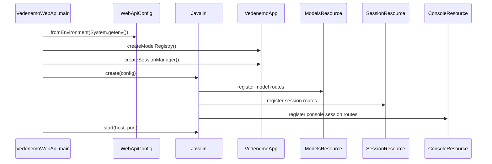

### Add And List Models

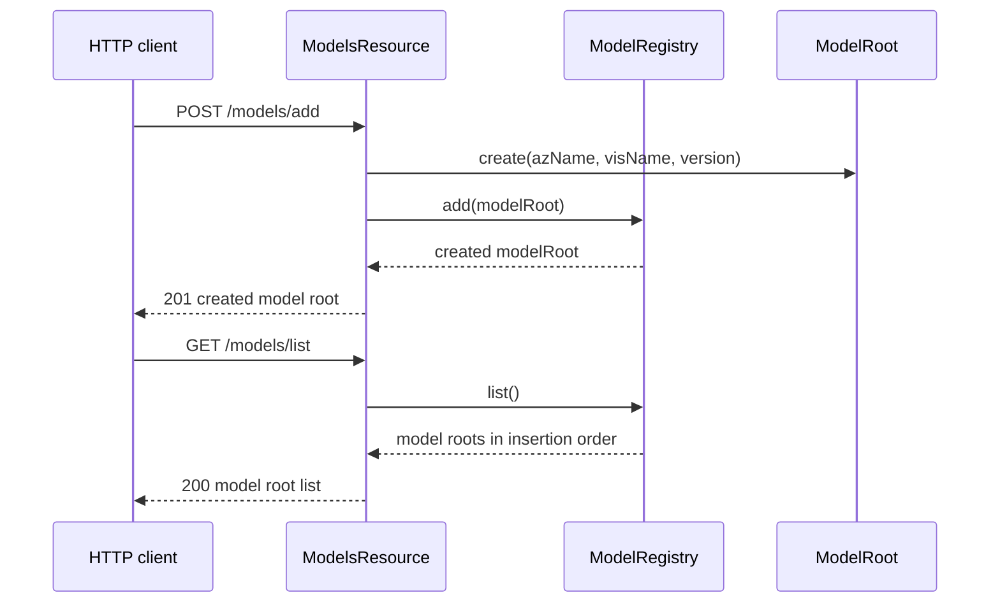

### CLI Session Lifecycle

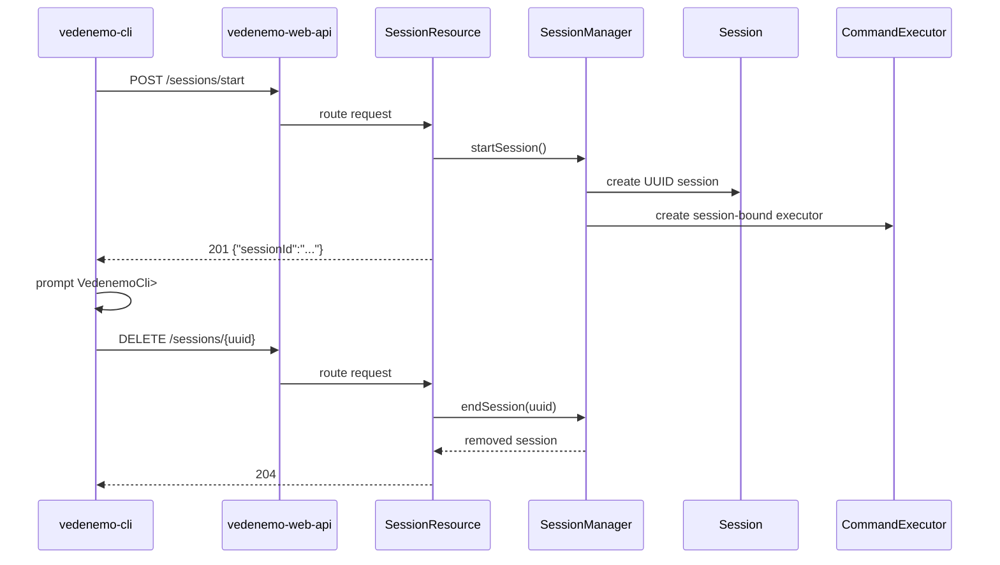

### CLI Model Management

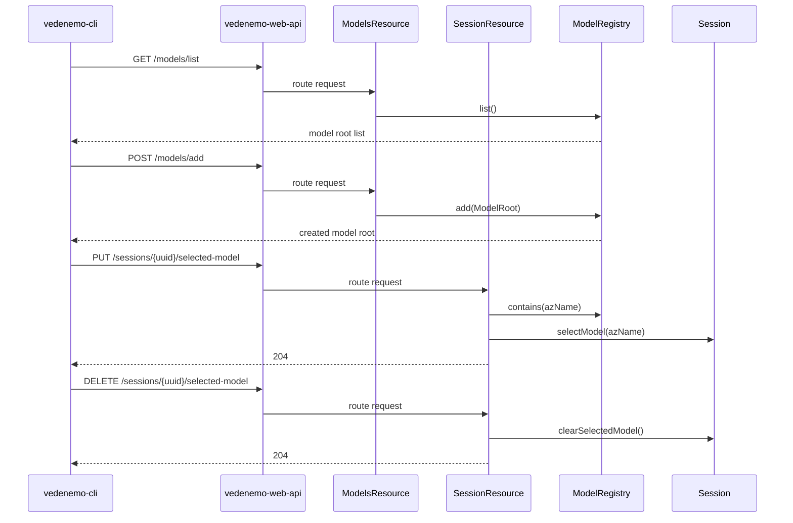

### CLI Entity, Attribute, And Association Commands With Undo

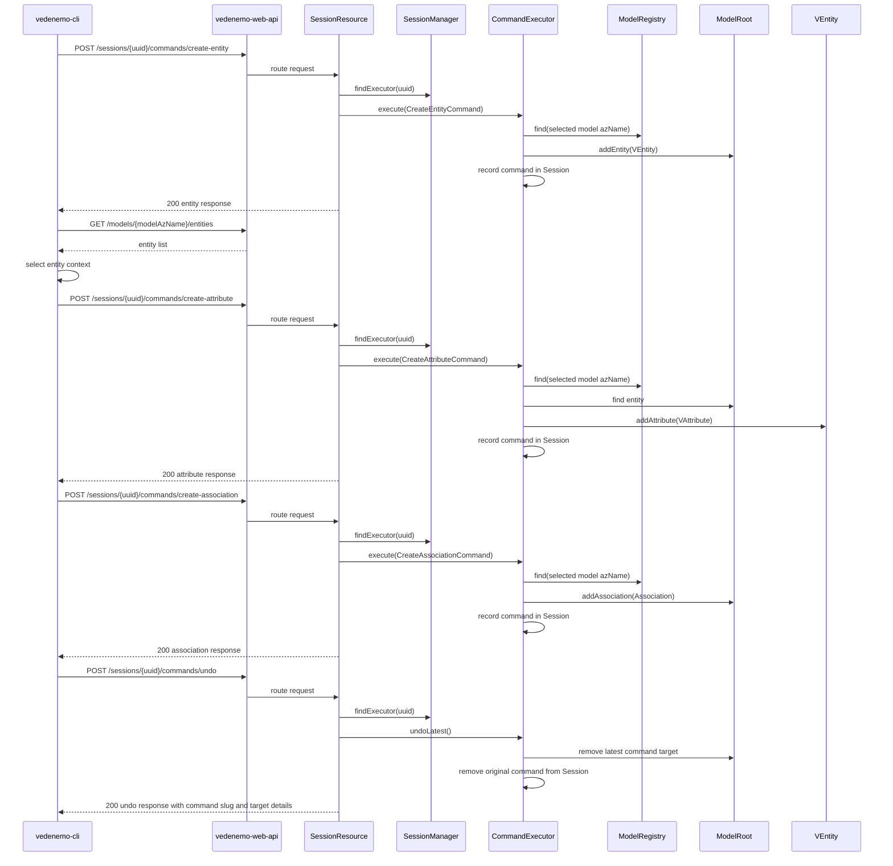

### UX Model Selection And PlantUML Rendering

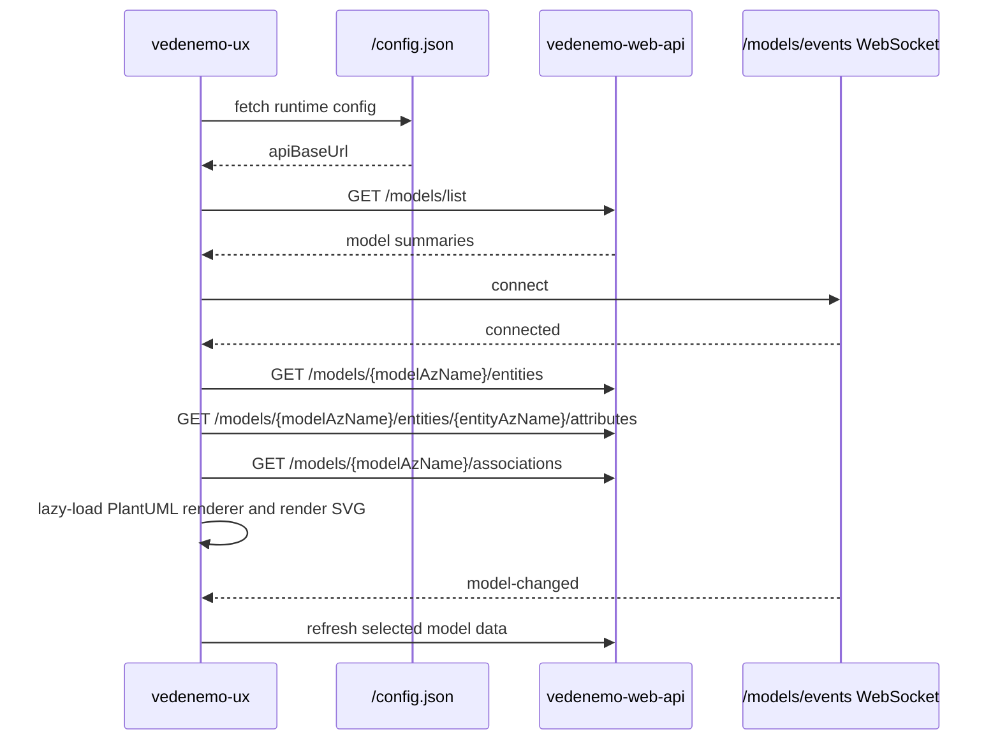

### UX Model Instance Tree Refresh

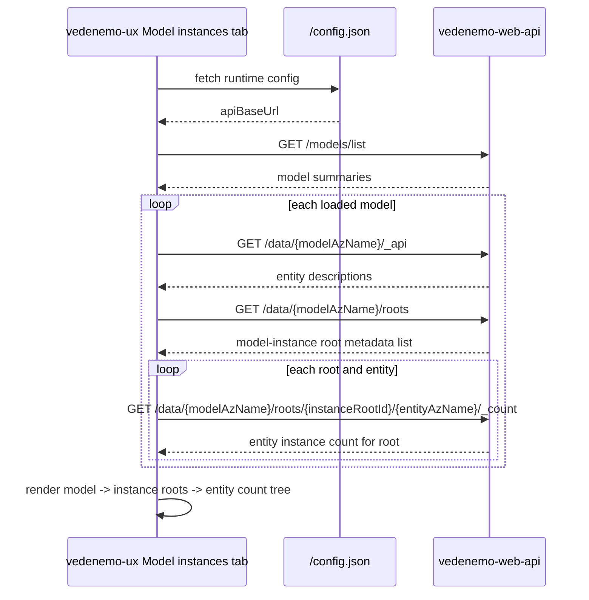

### UX Model Instance API Documentation

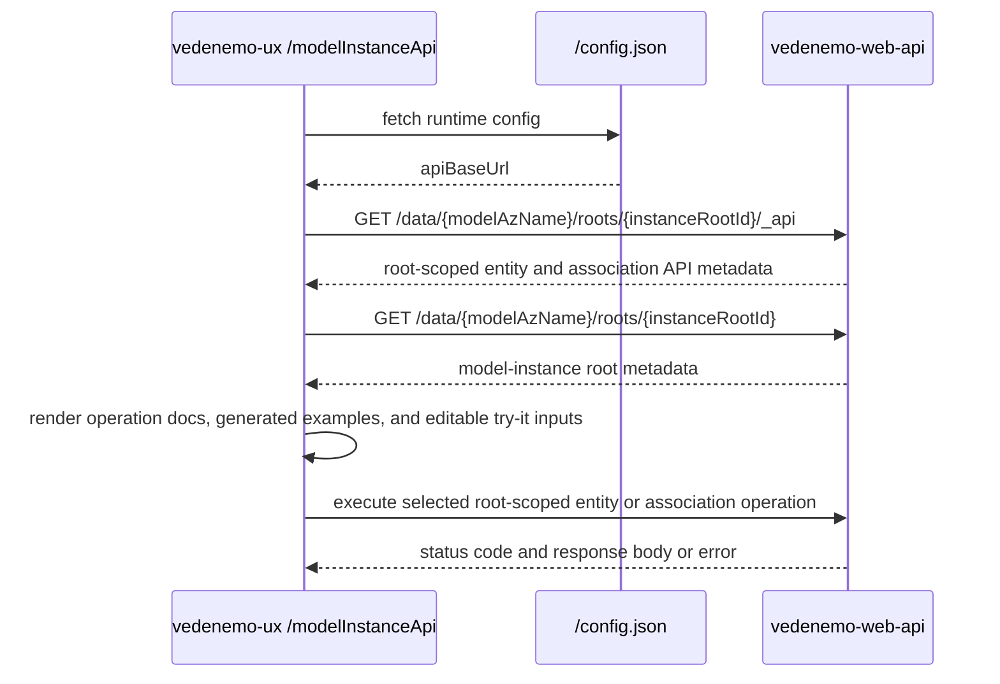

### UX Model Instance Visualization Wizard

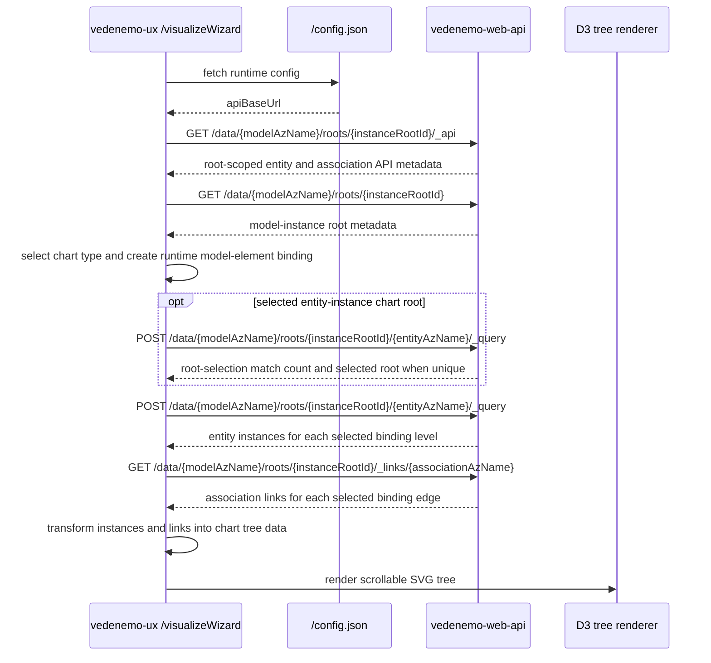

### UX Runtime Data Editing

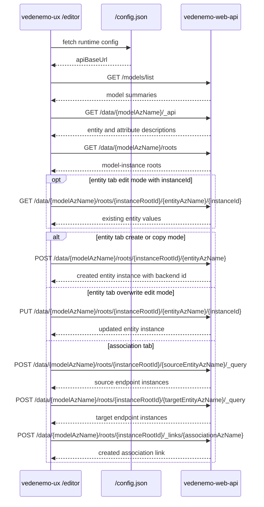

### Web Console Command Execution

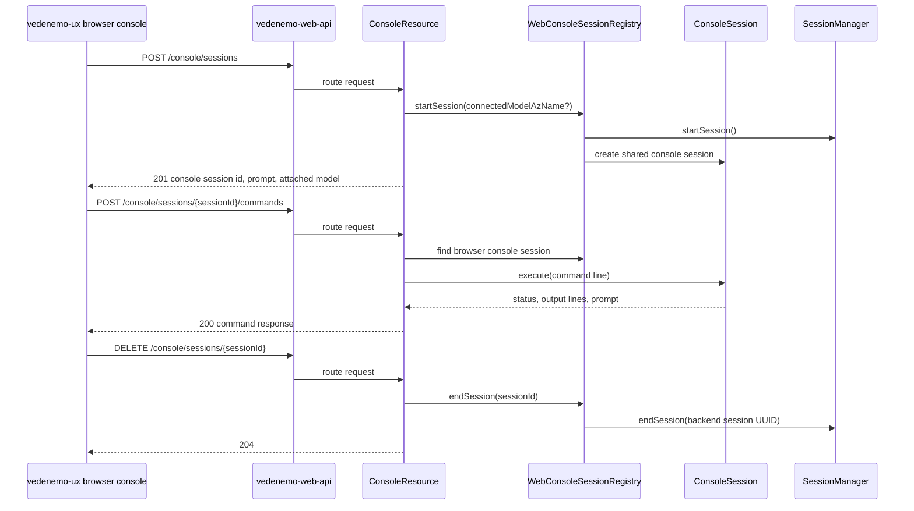

## CI and Deployment

GitHub Actions contains separate backend and frontend CI workflows:

- backend CI runs `mvn -B clean verify`
- frontend CI runs `npm ci` and `npm run build` in `vedenemo-ux`

Backend verification includes focused model API tests for `ModelRoot`,
`VAttribute`, `VEntity`, and lifecycle validation, focused core tests for
`Session`, `SessionManager`, create-entity/create-attribute command execution,
and undo behavior, focused CLI tests for backend URL configuration, non-hanging
prompt behavior, model commands, entity context, attribute command creation, and
undo output, JUnit 5 endpoint tests for the model add/list/entity/attribute
read APIs, session lifecycle, selected-model, create-entity, create-attribute,
and undo HTTP APIs in `vedenemo-web-api`, and focused `InMemoryModelStorage`
tests for storing and loading `ModelRoot` instances.

The UX deployment workflow builds `vedenemo-ux` and deploys it to Firebase
Hosting when required GitHub variables are present. The deployment workflow can
override `public/config.json` from the `VEDENEMO_API_BASE_URL` GitHub variable.

## Architectural Constraints Reflected In Code

- `vedenemo-core` has only Vedenemo-owned module dependencies and Java JDK APIs.
- Storage is accessed through the Vedenemo-owned `ModelStorage` SPI.
- The in-memory storage adapter depends on the SPI; core does not depend on the
  adapter.
- HTTP framework and JSON dependencies are isolated in `vedenemo-web-api`.
- The CLI talks to the backend through JDK HTTP client APIs and does not import
  Javalin, Jackson, or Vedenemo core types.
- Shared CLI-like command behavior lives in `vedenemo-command-console`; terminal
  and browser entry points provide their own transport/UI adapters.
- Application assembly is explicit constructor wiring, currently in
  `vedenemo-app`, `vedenemo-cli`, and the web API runtime.
- The current model registry and session manager are process-local and not
  durable.

## Current Gaps

The current implementation does not yet contain:

- user-visible deletion/edit commands for entities or attributes
- generic command envelope or command replay persistence
- durable persistence
- parser generator based `.vdos` grammar tooling
