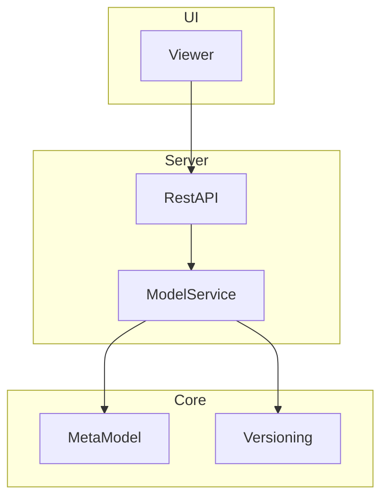

# Architecture Documentation Instructions

## Purpose

Maintain `docs/architecture_doc.md` as the authoritative high-level
documentation of the current concrete implementation.

The document is **living documentation** and must evolve together with the
codebase. Every meaningful architectural change should be reflected in the
document.

The goal is **not** to document every implementation detail, but to provide a
concise and accurate overview for both human developers and AI agents.

`docs/architecture_doc.md` is different from architecture definition and
planning documents. It describes what currently exists in code and repository
configuration. Definition/planning documents may describe rules, constraints,
decisions, future direction, or intended architecture that is not fully visible
in the implementation yet.

---

# General Principles

* Always keep the document synchronized with the current implementation.
* Prefer updating existing sections over creating duplicate information.
* Remove obsolete information.
* Avoid speculative or future architecture unless explicitly marked as planned.
* Document only architecture that actually exists in the repository.
* Keep planned vision separate from current implementation. Prefer linking to
  planning documents over restating future plans.

---

# Level of Abstraction

Describe:

* major components
* responsibilities
* dependencies
* interactions
* architectural layers
* important design decisions
* external integrations
* extension points

Avoid documenting:

* individual methods
* implementation algorithms
* private helper classes
* temporary experiments
* trivial implementation details

---

# Mermaid Diagrams

Use Mermaid diagrams directly inside the Markdown document.

Do **not** generate PNG or SVG images.

Prefer these diagram types:

* flowchart
* classDiagram
* sequenceDiagram
* stateDiagram

The primary architecture overview should use a layered `flowchart`.

Example:

---

# Component Overview

Maintain a section describing each major component.

Each component should contain:

* purpose
* main responsibilities
* important dependencies
* public interfaces (if relevant)

---

# Layering

When architectural layers exist, represent them using Mermaid `subgraph`s.

Examples:

* UI
* Application
* Domain
* Infrastructure

Only introduce layers that genuinely exist.

---

# Dependencies

Document only meaningful dependencies.

Avoid clutter.

Prefer showing:

* service dependencies
* module dependencies
* plugin interfaces
* communication paths

Avoid showing every source-code dependency.

---

# Runtime Behaviour

When useful, include Mermaid sequence diagrams describing important workflows.

Examples:

* startup
* request processing
* model loading
* plugin interaction
* synchronization

Only document representative flows.

---

# Design Decisions

Maintain a section describing significant architectural decisions.

Each decision should briefly explain:

* what was chosen
* why
* important consequences

Avoid lengthy historical discussions.

---

# Extension Points

Document extension mechanisms such as:

* plugin APIs
* SPI interfaces
* scripting
* external integrations
* agent interfaces

Explain how new functionality can be added.

---

# Architectural Constraints

Document important constraints such as:

* module boundaries
* dependency rules
* layering rules
* technology restrictions
* compatibility requirements

---

# Accuracy Rules

Never invent architecture.

If uncertain:

* inspect the repository
* infer only from existing code
* omit unknown information

Prefer incomplete but accurate documentation over speculative documentation.

---

# Writing Style

* concise
* technical
* objective
* easy to scan
* Markdown first
* diagrams before long prose
* short paragraphs
* bullet lists where appropriate

---

# Update Policy

Whenever the implementation changes:

1. Update affected diagrams.
2. Update affected component descriptions.
3. Remove obsolete architecture.
4. Add new components if introduced.
5. Keep terminology consistent.
6. Keep diagrams synchronized with the text.

The document should always describe the architecture of the current codebase—not its history.
